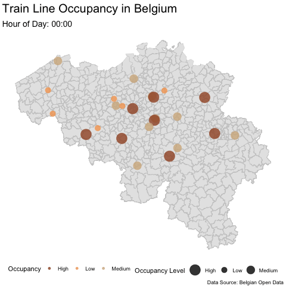

<style>
#TOC {
  background: url("C:/Users/Emily/OneDrive/Desktop/MUSA/PublicPolicyAnalytics/fair-fare/Fair Fare.png");
  background-size: contain;
  padding-top: 270px !important;
  background-repeat: no-repeat;
}
</style>
```{r setup, include=FALSE, warning = FALSE, message = FALSE, results= "hide"}
knitr::opts_chunk$set(echo = TRUE)
```


```{r, warning = FALSE, message = FALSE, results="hide", include = FALSE}
# setup

library(tidyverse)
library(sf)
library(leaflet)
library(lubridate)
library(scales)
library(jsonlite)
library(ggplot2)
library(raster)
library(FNN)
library(ggpubr)
library(gganimate)
library(magick)
library(gifski)
library(transformr)
library(spdep)
library(nnet)
library(caret)
library(MLmetrics)
library(knitr)
library(kableExtra)
library(pROC)
library(zoo)

pallette <- c("#0c0b0a", "#6A5234", "#b38b5b", "#bcb09f", "#f3e3cb")
pallette_bck <- c("#f3e3cb", "#bcb09f", "#b38b5b", "#6A5234", "#0c0b0a")
```


## Introduction
Belgium’s railway network serves as a critical component of its public transportation infrastructure, moving thousands of passengers daily across urban and regional lines. However, increasing train occupancy levels during peak hours have led to significant challenges in safety, operational efficiency, and passenger satisfaction. Overcrowded trains, particularly in cities like Brussels, exacerbate passenger discomfort, increase safety risks, and strain operational resources. Addressing these issues necessitates a data-driven solution that optimizes train capacity while ensuring passenger safety and improving the travel experience.

### The Problem
Overcrowding on trains presents interconnected safety, operational, and environmental challenges. \n


**Safety Risks:** Overcrowded trains significantly increase the likelihood of non-violent crimes, such as theft and harassment, with over 3,500 crimes reported annually in and around Belgian train stations. Additionally, high-density conditions lead to more frequent accidents, such as falls and medical emergencies, compromising passenger safety. \n


**Passenger Discomfort:** Packed trains degrade the overall travel experience, discouraging individuals from using public transport. This often shifts travelers to private vehicles, worsening urban congestion and increasing environmental pollution. \n


**Operational Inefficiencies:** Current fare systems are static and fail to adapt to fluctuating demand across routes and times. Peak-hour trains are often overcrowded while off-peak services operate underutilized. These inefficiencies prevent transit agencies from optimizing revenue or improving passenger distribution.
Together, these issues highlight the urgent need for a system that addresses both safety and operational inefficiencies.

### The Solution
*Fair Fare* is a public-facing, transit authority-operated app that will mitigate overcrowding on trains and inefficient operations.  *Fair Fare* aims to achieve these goals by predicting train occupancy, allowing users to make informed decisions about which trains to ride and transit authorities to implement a dynamic pricing model that will redistribute crowds.  On trains with a high predicted occupancy, *Fair Fare* suggests that ticket prices are raised 15%, while trains with a low predicted occupancy should have their prices reduced by 15%.  This way, riders are encouraged to choose low-occupancy trains, boosting operational efficiency, and avoid high-occupancy trains, reducing crime.


## Methodology

### Overview:
1. Data Cleaning 
2. Exploratory Data Analysis
3. Model Development 
4. Model Validation
5. Cost Benefit Analysis 


### Data Cleaning
##### Read in Data:
 + Trip (<a href= "https://www.kaggle.com/c/train-occupancy-prediction/data">Kaggle</a>)
     + 3-level (**low, medium, high**) occupancy rate `occupancy`
     + Timestamp `timestamp`
     + Origin station ID `from_station`
     + Destination Station `to_station`
```{r, warning = FALSE, message = FALSE, results= "hide", result= FALSE}
process_json_line <- function(line) {
  tryCatch({
    data <- fromJSON(line)

    tibble(
      timestamp = ymd_hms(data$querytime),
      from_station = gsub("http://irail.be/stations/NMBS/", "", data$post$from),
      vehicle = gsub("http://irail.be/vehicle/", "", data$post$vehicle),
      occupancy = gsub("http://api.irail.be/terms/", "", data$post$occupancy),
      to_station = gsub("http://irail.be/stations/NMBS/", "", data$post$to),
      date = as.Date(data$querytime),
      weekday = wday(ymd_hms(data$querytime), label = TRUE),
      hour = hour(ymd_hms(data$querytime))
    )
  }, error = function(e) {
    NULL
  })
}

occupancy_lines <- readLines("data/occupancy-until-20161029.txt")
occupancy_data <- do.call(rbind, lapply(occupancy_lines, process_json_line)) %>%
  as_tibble() %>%
  filter(!is.na(timestamp))

```

  + Municipal Boundaries of Belgium (<a href="https://hub.arcgis.com/datasets/esribeluxdata::belgium-municipalities-1/about">StatBel</a>)
     + Municipality ID `CODE_INS`
     + `geometry`
```{r, warning = FALSE, message = FALSE, results= "hide"}
munis <- st_read("data/munis.geoJSON")
munis <- mutate(munis, CODE_INS = as.numeric(CODE_INS))
```

 + Stations (<a href= "https://www.kaggle.com/c/train-occupancy-prediction/data">Kaggle</a>)
     + Station ID `station_id`
     + Station name `name`
     + Longitude `longitude`
     + Latitide `latitude`
     
```{r, warning = FALSE, message = FALSE, results= "hide"}
stations <- read.csv("data/stations.csv") %>%
  dplyr::select(URI, name, country.code, longitude, latitude, avg_stop_times) %>%
  mutate(
    name = gsub("/.*", "", name),
    station_id = gsub("http://irail.be/stations/NMBS/", "", URI)
  ) %>%
  filter(country.code == "be") %>% # only keep stops in Belgium
  dplyr::select(-URI, -country.code)

stations_sf <- st_as_sf(stations, coords= c("longitude", "latitude"))
st_crs(stations_sf) <- crs(munis)
```

 + Train Lines (<a href= "https://github.com/GillesVandewiele/KaggleTrainOccupancy/tree/master">Github</a>)
     + Vehicle ID `vehicle_id`
     + Vehicle type `vehicle_type`
     + List of stations on line `stopping_station_ids`
     + Line number `X`
```{r, warning = FALSE, message = FALSE, results= "hide"}

lines <- read.csv("data/line_info.csv")

# Transform the dataframe
station_lines <- lines %>%
  separate_rows(stopping_station_ids, sep = ",") %>%
  rename(station_id = stopping_station_ids) %>%
  mutate(
    station_id = str_replace_all(station_id, "'", ""),
    station_id = str_replace_all(station_id, "\\]", ""),
    station_id = str_replace_all(station_id, "\\[", ""),
    station_id = str_replace_all(station_id, " ", "")
  ) %>%
  group_by(station_id) %>%
  summarise(
    lines = paste(unique(X), collapse = ", "),  # Ensure no duplicates in lines before concatenating
    .groups = "drop"
  ) %>%
  mutate(
    lines = str_replace_all(lines, " ", ""),
    lines = str_split(lines, ",")
  )
  
```

 + Weather (<a href= "https://github.com/GillesVandewiele/KaggleTrainOccupancy/tree/master">Github</a>)
     + Station Name `station_name`
     + Time stamp `date_time`
     + Temperature `temperature`
     + Humidity `humidity`
     + Wind speed `wind_speed`
     + Visibility `visibility`
     + Weather type `weather_type`

```{r, warning = FALSE, message = FALSE, results= "hide"}
all_weather <- do.call(rbind, lapply(list.files("data/weather", pattern = "\\.csv$", full.names = TRUE), read.csv)) %>%
  mutate(date_time = as.POSIXct(
  date_time, format = "%Y-%m-%d %H:%M")
  ) %>%
  unique() %>%
  dplyr::select(-lat, -lng, -X)
```

  + Population in Belgium (<a href = "https://statbel.fgov.be/nl/open-data/bevolking-naar-woonplaats-nationaliteit-burgerlijke-staat-leeftijd-en-geslacht-10">StatBel</a>)
     + Municipality ID `CD_REFNIS`
     + Population `MS_POPULATION`
```{r, warning = FALSE, message = FALSE, results= "hide"}
pop <- read.csv("data/TF_SOC_POP_STRUCT_2021.csv")
pop_muni <- pop %>%
  group_by(CD_REFNIS) %>%
  summarize(population = sum(MS_POPULATION))

```

  + 2016 Income in Belgium (<a href = "https://statbel.fgov.be/en/themes/datalab/administrative-disposable-income">StatBel</a>)
     + Municipality ID `CD_MUNTY_REFNIS`
     + Median Income `MS_MEDIUM`
```{r, warning = FALSE, message = FALSE}
income <- read.csv("data/TF_SOC_ADI_MUNTY.csv")
inc2016 <- filter(income, CD_YEAR == 2016)
```

##### Prepare Data:

1. Join population and income to municipality geometries, imputing missing data.

```{r, warning = FALSE, message = FALSE, results= "hide"}

munis_inc16 <- left_join(munis, inc2016, by = c("CODE_INS" = "CD_MUNTY_REFNIS")) 

#impute missing
centroids <- st_centroid(munis_inc16)
coords <- st_coordinates(centroids)
na_indices <- which(is.na(munis_inc16$MS_MEDIAN))
knn_result <- get.knn(coords, k = 5)

munis_inc16$MS_MEDIAN_imputed <- munis_inc16$MS_MEDIAN  # Create a new column for imputed values

for (i in na_indices) {
  neighbors <- knn_result$nn.index[i, ]
  valid_neighbors <- neighbors[!is.na(munis_inc16$MS_MEDIAN[neighbors])]
  if (length(valid_neighbors) > 0) {
    munis_inc16$MS_MEDIAN_imputed[i] <- mean(munis_inc16$MS_MEDIAN[valid_neighbors], na.rm = TRUE)
  }
}

munis_pop <- left_join(munis, pop_muni, by = c("CODE_INS" = "CD_REFNIS"))

na_indices_pop <- which(is.na(munis_pop$population))

#impute

munis_pop$population_imputed <- munis_pop$population  
for (i in na_indices_pop) {
  neighbors <- knn_result$nn.index[i, ]
  valid_neighbors <- neighbors[!is.na(munis_pop$population[neighbors])]
  if (length(valid_neighbors) > 0) {
    munis_pop$population_imputed[i] <- mean(munis_pop$population[valid_neighbors], na.rm = TRUE)
  }
}

```
 
 
 2. Use the area of the municipality polygons to calculate population density.
 
```{r, warning = FALSE, message = FALSE, results= "hide"}

munis_pop$Area_km <- st_area(munis_pop) /1000
munis_pop$pop_dens <- munis_pop$population_imputed/ as.numeric(munis_pop$Area_km) 
munis_pop$pop_dens_quintile <- as.factor(ntile(munis_pop$pop_dens, 5))
```

  3. Join station and trip line data.
  
```{r, warning = FALSE, message = FALSE, results= "hide"}

stations <- left_join(stations, station_lines)
```

  4. Join population, income, and municipal boundaries to stations, keeping station geometry.
```{r, warning = FALSE, message = FALSE, results= "hide"}


allvars_munis <- left_join(st_drop_geometry(munis_inc16), dplyr::select(st_drop_geometry(munis_pop), pop_dens, pop_dens_quintile, Area_km, CODE_INS))

allvars_munis <- left_join(dplyr::select(munis_inc16, geometry, CODE_INS), allvars_munis)

# Check for invalid geometries in allvars_munis
invalid_geometries <- st_is_valid(allvars_munis)
if (any(!invalid_geometries)) {
    print(allvars_munis[!invalid_geometries, ])
    allvars_munis <- st_make_valid(allvars_munis)
}

be_stations <- stations_sf

invalid_geometries <- st_is_valid(allvars_munis)
if (any(!invalid_geometries)) {
    # Fix invalid geometries
    allvars_munis <- st_make_valid(allvars_munis)
}


liteVars_munis <- allvars_munis %>% dplyr::select(CODE_INS, geometry, MS_MEDIAN, MS_MEDIAN_imputed, pop_dens, pop_dens_quintile, Area_km)

stations_munis <- st_join(be_stations, liteVars_munis) %>% distinct()

```


  5. Join trip data with train line data, using the destination station as the primary key.
  
```{r, warning = FALSE, message = FALSE, results= "hide"}

occupancy_data <- occupancy_data %>%
  mutate(
    weekday_f = as.factor(weekday),
    hour_f = as.factor(hour),
    from_station = as.character(from_station),
    to_station = as.character(to_station), 
    occupancy_num = case_when(
      occupancy == "high" ~ 3,
      occupancy == "medium" ~ 2,
      occupancy == "low" ~ 1
    ),
   week = week(timestamp)
  )
occupancy_data <- occupancy_data %>%
  mutate(
    rush_type = case_when(
      hour >= 4 & hour <= 8 ~ "morning rush",
      hour > 8 & hour <= 12 ~ "lunch rush",
      hour > 12 & hour <= 19 ~ "evening rush",
      hour > 19 | hour <= 3 ~ "dead hours",
      TRUE ~ "non-rush"
    )
  )
occupancy_data$trip_id <- 1:nrow(occupancy_data)

# Join to get the lines for to_station and from_station
occupancy_data <- occupancy_data %>%
  left_join(station_lines, by = c("to_station" = "station_id")) %>%
  rename(to_station_lines = lines) %>%
  left_join(station_lines, by = c("from_station" = "station_id")) %>%
  rename(from_station_lines = lines) %>%
  # Find the intersection of lines
  mutate(
    trip_lines = map2(to_station_lines, from_station_lines, ~ intersect(.x, .y))  # Find common lines
  )

occupancy_data <- occupancy_data %>%
  mutate(
    trip_lines = map(trip_lines, ~ unique(.x)),       # Remove duplicates
    trip_lines = map(trip_lines, ~ sort(.x)),         # Sort line numbers
    first_trip_line = map_chr(trip_lines, ~ if (length(.x) > 0) .x[1] else NA_character_) # Extract first line 
  ) %>%
  dplyr::select(-to_station_lines, -from_station_lines) %>%
  left_join(dplyr::select(lines, vehicle_id, vehicle_type), by = c("vehicle" = "vehicle_id"))


```


  6.  Join trip data with the combined municipality/station data from Step 4, using destination as a primary key.  Join the resultant data with origin station data, to create copies of the municipality/station data, one for the origin station, the other for the destination station.  Now, only weather data is missing.

```{r, warning = FALSE, message = FALSE, results= "hide"}
stations_munis <- mutate(stations_munis, "muni" = CODE_INS) %>%
  distinct()


# Join the unique trips data with stations
trips_to_station <- left_join(stations_munis, occupancy_data, by = c("station_id" = "to_station")) %>% distinct() %>% filter(!is.na(trip_id))
trips_from_station <- left_join(stations_munis, occupancy_data, by = c("station_id" = "from_station")) %>% distinct() %>% filter(!is.na(trip_id)) 


# lets make a to/from station muni category

trips_to_station <- left_join(st_drop_geometry(trips_to_station), dplyr::select(st_drop_geometry(trips_from_station), muni, name, trip_id, pop_dens, pop_dens_quintile, MS_MEDIAN_imputed, avg_stop_times), by= ("trip_id" = "trip_id"), suffix = c(".to", ".from"))

trips_to_station <- left_join(trips_to_station, dplyr::select(stations_munis, geometry, station_id), by = c("station_id" = "station_id"))

trips_from_station <- left_join(st_drop_geometry(trips_from_station), dplyr::select(st_drop_geometry(trips_to_station), muni.to, trip_id, name.to, pop_dens.to, pop_dens_quintile.to, MS_MEDIAN_imputed.to, avg_stop_times.to), by= ("trip_id" = "trip_id"))

trips_from_station <- left_join(trips_from_station, dplyr::select(stations_munis, geometry, station_id), by = c("station_id" = "station_id"))
```
  
  
  7. Join weather to the result from Step 6, by rounding trip time stamps to the nearest hour to match the frequency of weather data collection.  Then, impute any missing weather values for each trip.  The resultant data frame has all variables, connected by destination station, with the `trip_id` as the unique identifier for each row.
```{r, warning = FALSE, message = FALSE, results= "hide"}
trips_to_station <- trips_to_station %>%
  mutate(rounded_timestamp = round_date(timestamp, "1 hour")) %>%
  st_as_sf() %>%
  filter(!is.na(trip_id))

trips_to_station <- left_join(st_drop_geometry(trips_to_station), all_weather, by = c("name.from" = "station_name", "rounded_timestamp" = "date_time")) 

trips_to_station <- trips_to_station %>%
  group_by(station_id) %>%
  mutate(
  #Impute using previous and next values, if missing
    temperature = ifelse(is.na(temperature), zoo::na.approx(temperature, rule = 2), temperature),
    
    windspeed = ifelse(is.na(windspeed), zoo::na.approx(windspeed, rule = 2), windspeed),
    
    humidity = ifelse(is.na(humidity), zoo::na.approx(humidity, rule = 2), humidity),
    
    visibility = ifelse(is.na(visibility), zoo::na.approx(visibility, rule = 2), visibility)
  ) %>%
  ungroup()

# Impute categorical variable (weather_type)
trips_to_station <- trips_to_station %>%
  group_by(station_id) %>%
  mutate(
    weather_type = ifelse(is.na(weather_type), 
                          zoo::na.locf(weather_type, fromLast = TRUE),  # Impute using last valid observation
                          weather_type)
  ) %>%
  ungroup()

```

  
### Exploratory Data Analysis

Now, we can visualize these variables to examine which might be most useful at predicting train occupancy.

```{r, warning = FALSE, message = FALSE}
p16 <- ggplot() + geom_sf(data = munis_inc16, aes(fill = MS_MEDIAN), color = NA) + ggtitle("Reported") + theme_void()+ scale_fill_continuous(low = pallette[2], high = pallette[5], na.value="lightgray", name= "Median Income", breaks = c(10000, 20000, 30000), labels = c("10k", "20k", "30k"))
p22 <- ggplot() + geom_sf(data = munis_inc16, aes(fill = MS_MEDIAN_imputed),color=NA) + ggtitle("NAs Imputed by 5 NN Avg") + theme_void() + scale_fill_continuous(low = pallette[2], high = pallette[5], na.value="lightgray", name= "Median Income", breaks = c(10000, 20000, 30000), labels = c("10k", "20k", "30k"))

ptot <- ggarrange(p16, p22, ncol = 2, common.legend = TRUE, legend = "bottom")
annotate_figure(ptot, top = text_grob("2016 Median Income in Belgium", 
                                      color = "black", face = "bold", size = 18))
```


There are not stark differences in median income across Belgium, but there are pockets where lower-income municipalities are concentrated.  These municipalities may be more likely to use transit than wealthier municipalities who likely have increased access to cars.

```{r, warning = FALSE, message = FALSE}
g1 <- ggplot() + geom_sf(data = munis_pop, aes(fill = pop_dens), color = NA) + scale_fill_continuous(low = pallette[2], high = pallette[5], na.value="lightgray", name = "People/ Km")+ theme_void() + ggtitle("Raw")

g2 <- ggplot() + geom_sf(data = munis_pop, aes(fill = pop_dens_quintile), color = NA) + scale_fill_discrete(type = pallette, name = "Population Density Quintile") +theme_void() + ggtitle("Quintile")

ptot2 <- ggarrange(g1, g2, nrow = 2)
annotate_figure(ptot2, top = text_grob("2021 Population Density by Municipalities in Belgium", 
                                      color = "black", face = "bold", size = 18))
```


The population density of Brussels, in central Belgium, is noticeably much higher than the rest of Belgium.  This may mean that trips with origins or destinations as stations in Brussels could have higher occupancies on average.  Oppositely, all the municipalities in Southern Belgium have very low population densities, possibly leading to far more low occupancy trains going to/ coming from that area. 


```{r, warning = FALSE, message = FALSE}
gp1 <- ggplot() + geom_sf(data = liteVars_munis, fill = NA, color = "lightgray")+ geom_sf(data = stations_munis, aes(color = MS_MEDIAN_imputed, size = pop_dens_quintile), alpha = 0.5) + theme_void() + scale_color_continuous(low = "brown", high = pallette[1], name = "Median Income") + scale_size_discrete(name = "Population Density Quintile")

annotate_figure(gp1, top = text_grob("Belgian Train Stations by Municipal \n Population Density and Median Income", 
                                      color = "black", face = "bold", size = 18))
```


After combining this information, it's evident that some of the stations in the lowest-income municipalities are also the most populous.  Additionally, the less populous areas of southern Belgium tend to be lower-income.  Both of these features and their patterns can be used to bolster the accuracy of the prediction model.  

```{r, warning = FALSE, message = FALSE}

trips_by_hour <- occupancy_data %>%
  group_by(hour) %>%
  summarise(count = n(), .groups = 'drop') %>%
  mutate(
    rush_type = case_when(
      hour >= 4 & hour <= 8 ~ "morning rush",
      hour > 8 & hour <= 12 ~ "lunch rush",
      hour > 12 & hour <= 19 ~ "evening rush",
      hour > 19 | hour <= 3 ~ "dead hours",
      TRUE ~ "non-rush"))

# Complete the dataset for all hour-rush_type combinations
trips_by_hour_complete <- expand.grid(
  hour = 0:23,
  rush_type = c("morning rush", "lunch rush", "evening rush", "dead hours")
) %>%
  left_join(trips_by_hour, by = c("hour", "rush_type")) %>%
  mutate(count = ifelse(is.na(count), 0, count))

# Re-order `rush_type` for consistent stacking
trips_by_hour_complete$rush_type <- factor(
  trips_by_hour_complete$rush_type,
  levels = c("morning rush", "lunch rush", "evening rush", "dead hours")
)

# Plot
tm1 <- ggplot(trips_by_hour_complete) +
  geom_area(aes(x = hour, y = count, fill = rush_type), position = "stack") +
  scale_fill_discrete(type = pallette) + 
  theme_minimal() +
  scale_x_continuous(breaks = 0:23) +
  labs(x = "Hour of Day", y = "Count of Trips", fill = "Rush Type")

annotate_figure(tm1, top = text_grob("Train Trips by Hour, Grouped by Rushes", 
                                      color = "black", face = "bold", size = 18))


```


There are 3 notable peaks in daily patterns, which were grouped into morning, lunch, and evening rush, while the trips outside of a rush were grouped into dead hours.  This feature engineering may help improve the final model's accuracy.


```{r, warning = FALSE, message = FALSE}
daily_occupancy <- occupancy_data %>%
    group_by(date, occupancy) %>%
    summarise(count = n(), .groups = 'drop')
  
  # Ensure the levels of 'occupancy' are ordered
daily_occupancy$occupancy <- factor(daily_occupancy$occupancy, levels = c("low", "medium", "high"))

# Define a custom palette with colors for each level
custom_colors <- c("low" = pallette[1], "medium" = pallette[3], "high" = pallette[5])

# Plot with custom legend order and colors
p4 <- ggplot(daily_occupancy, aes(x = date, y = count, fill = occupancy)) +
    geom_area(position = "stack") +
    scale_fill_manual(values = custom_colors) +  # Set custom colors
    theme_minimal() +
    labs(
      x = "Date",
      y = "Number of Trips",
      fill = "Occupancy Level"
    )

  
  annotate_figure(p4, top = text_grob("Monthly Train Occupancy Patterns", 
                                      color = "black", face = "bold", size = 18))
```


Most trips are low occupancy, meaning the transit agency is losing money by operating these low-capacity trains.  Additionally, far more trips occur during the colder months, making these months a vital time to focus on crowd redistribution.

```{r, warning = FALSE, message = FALSE}

top_routes <- occupancy_data %>%
    filter(!is.na(to_station)) %>%
    count(from_station, to_station, sort = TRUE) %>%
    left_join(stations %>% dplyr::select(station_id, name), 
              by = c("from_station" = "station_id")) %>%
    left_join(stations %>% dplyr::select(station_id, name), 
              by = c("to_station" = "station_id"), 
              suffix = c("_from", "_to")) %>% head(20)
  
  p3 <- ggplot(top_routes, aes(x = reorder(name_from, n), 
                              y = reorder(name_to, n), 
                              fill = n)) +
    geom_tile() +
    scale_fill_continuous(low = pallette[2], high = pallette[5]) +
    theme_minimal() +
    theme(axis.text.x = element_text(angle = 45, hjust = 1)) +
    labs(
      x = "From Station",
      y = "To Station",
      fill = "Number of Trips"
    )
  
  annotate_figure(p3, top = text_grob("Most Common Origin-Destination Pairs", 
                                      color = "black", face = "bold", size = 18))

```


Unsurprisingly, the Brussel-Centraal station, the main station, is connected to the most high-frequency routes.  This aligns with the prior observation that Brussels is noticeably more populous than any of the surrounding municipalities.


```{r, warning = FALSE, message = FALSE}
 occupancy_by_hour <- occupancy_data %>%
    group_by(hour, occupancy) %>%
    summarise(count = n(), .groups = 'drop')

occupancy_by_hour$occupancy <- factor(occupancy_by_hour$occupancy, levels = c("low", "medium", "high"))
  
po <- ggplot(occupancy_by_hour, aes(x = hour, y = count, fill = occupancy)) +
    geom_bar(stat = "identity", position = "stack") +  # Use position = "stack"
    scale_fill_manual(values = custom_colors) +
    theme_minimal() +
    labs(
      x = "Hour of Day",
      y = "Number of Trips",  # Adjusted y-axis label
      fill = "Occupancy Level"
    )

annotate_figure(po, top = text_grob("Train Occupancy Distribution by Hour", 
                                      color = "black", face = "bold", size = 18))
```


The number of trips follows a solid daily pattern, but the breakdown of occupancy levels within those trips remains relatively similar throughout the day.


```{r, warning = FALSE, message = FALSE}
occupancy_by_weekday <- occupancy_data %>%
    group_by(weekday, occupancy) %>%
    summarise(count = n(), .groups = 'drop')

occupancy_by_weekday$occupancy <- factor(occupancy_by_weekday$occupancy, levels = c("low", "medium", "high"))
  
  pw <- ggplot(occupancy_by_weekday, aes(x = weekday, y = count, fill = occupancy)) +
    geom_bar(stat = "identity", position = "stack") +
     scale_fill_manual(values = custom_colors) +
    theme_minimal() +
    labs(
      x = "Day of Week",
      y = "Proportion",
      fill = "Occupancy Level"
    )
  
  annotate_figure(pw, top = text_grob("Train Occupancy Distribution by Day of Week", 
                                      color = "black", face = "bold", size = 18))
```


There are far fewer train trips on the weekends, possibly indicating that Belgian transit is largely used for commuting to work rather than leisure travel.


```{r, warning = FALSE, message = FALSE}
tmper <- ggplot(trips_to_station, aes(x = temperature, fill = occupancy)) +
  geom_histogram(
    binwidth = 1,
    position = position_stack(), 
    alpha = 0.8
  ) +
  scale_fill_manual(values = c("low" = "#bcb09f", "medium" = "#b38b5b", "high" = "#6A5234")) +
  labs(
    x = "Temperature (°C)",
    y = "Number of Trips",
    fill = "Occupancy Level"
  ) +
  theme_minimal()

 annotate_figure(tmper, top = text_grob("Train Occupancy Levels by Temperature", 
                                      color = "black", face = "bold", size = 18))
```


Train usage is heavily concentrated within a moderate temperature range, likely reflecting weather conditions conducive to travel. High occupancy levels are less frequent, indicating potential underutilization of train capacity during many trips.


```{r, warning = FALSE, message = FALSE}
humo <- ggplot(trips_to_station, aes(x = humidity, fill = occupancy)) +
  geom_histogram(
    binwidth = 1,
    position = position_stack(), 
    alpha = 0.8
  ) +
  scale_fill_manual(values = c("low" = "#bcb09f", "medium" = "#b38b5b", "high" = "#6A5234")) +
  labs(
    x = "Humidity (%)",
    y = "Number of Trips",
    fill = "Occupancy Level"
  ) +
  theme_minimal()

 annotate_figure(humo, top = text_grob("Train Occupancy Levels by Humidity", 
                                      color = "black", face = "bold", size = 18))

```


The distribution of trips and humidity is heavily skewed, with far more trips occurring in places with higher humidity at that time.  This may indicate a positive relationship betwee humidity and the number of trips.  The proportion of high, medium, and low occupancy trips does not appear to vary much across humidity levels, though.


```{r, warning = FALSE, message = FALSE, eval= FALSE}

trips_to_station <- trips_to_station %>%
  mutate(
    hour_formatted = as.POSIXct(sprintf("%02d:00", hour), format = "%H:%M")
  )

animated_map <- ggplot() +
  geom_sf(data = liteVars_munis, fill = "gray90", color = "gray80") +
  geom_sf(data = trips_to_station, aes(color = occupancy, size = occupancy), alpha = 0.8) +
  scale_color_manual(
    name = "Occupancy",
    values = c("Low" = "#F4A460", "Medium" = "#D2B48C", "High" = "#A0522D")
  ) +
  scale_size_manual(
    name = "Occupancy Level",
    values = c("Low" = 4, "Medium" = 6, "High" = 8)
  ) +
  labs(
    title = "Train Line Occupancy in Belgium",
    subtitle = "Hour of Day: {format(frame_time, '%H:%M')}",
    caption = "Data Source: Belgian Open Data"
  ) +
  theme_void() +
  theme(
    plot.title = element_text(size = 20, face = "bold"),
    plot.subtitle = element_text(size = 14),
    legend.position = "bottom"
  ) +
  transition_time(hour_formatted) +
  ease_aes('linear')

# Save the GIF
anim_save(
  "belgium_train_occupancy_brown_beige.gif",
  animation = animated_map,
  renderer = gifski_renderer()
)
```



High, low, and medium occupancy trips move throughout the country as the day carries on, not clustering around certain stations.  However, one constant is that the southern Belgium rarely has any trips in this data set.

### Develop Model

Because occupancy is a factor with three levels, a multinomial logisitic regression will be used to predict occupancy.  This model will consider both spatial and temporal patterns to boost its accuracy.

First, create spatial, temporal, and spatio-temporal lags to capture the relationship between trips that are near in time and space.  The time lags, `occupancy_lagX`, look back 1, 2, 24, and 168 hours (or 1 week).  The spatial lag, `spatial_lag`, is  the weighted average of the occupancy of the three nearest neighbor stations.  Lastly, the spatio-temporal lag, `time_line_lagX`, examines a time lag of 1 and 2 hours, but only for stations on the same line.  

```{r, warning = FALSE, message = FALSE, results = "hide"}
# time lag
trips_to_station <- trips_to_station %>%
  arrange(hour)

trips_to_station <- trips_to_station %>%
  mutate(occupancy_lag1 = lag(occupancy, 1), # 1 hour lag
         occupancy_lag2 = lag(occupancy, 2),
         occupancy_lag24 = lag(occupancy, 24), # 1 day lag
         occupancy_lag1 = lag(occupancy, 1),
         occupancy_lag168 = lag(occupancy, 168) # 1 week lag
         
         )  
# space-time lag
trips_to_station <- trips_to_station %>%
  arrange(first_trip_line, hour) %>%  # Ensure data is sorted by train_line and time
  group_by(first_trip_line) %>%       # Group by train_line
  mutate(
    time_line_lag1 = lag(occupancy, 1),   # 1 hour lag
    time_line_lag2 = lag(occupancy, 2)#,   # 2 hour lag
  ) %>%
  ungroup()  # Ungroup after the operation

# spatial weights

trips_to_station <- left_join(trips_to_station, dplyr::select(stations_sf, geometry, station_id))

trips_to_station <- st_as_sf(trips_to_station)

coords <- st_coordinates(st_centroid(trips_to_station))
knn <- knn2nb(knearneigh(coords, k = 3))  # 3 nearest neighbors

weights <- nb2listw(knn, style = "W")
trips_to_station$spatial_lag <- lag.listw(weights, trips_to_station$occupancy_num)

final_varlist_to <- trips_to_station

```


With all variables prepared, the multinomial logistic regressions can be created.

```{r, warning = FALSE, message = FALSE, results="hide"}
# train/test split
model_data <- st_drop_geometry(final_varlist_to)


model_data$temperature <- na.locf(model_data$temperature, na.rm = FALSE)
model_data$weather_type <- na.locf(model_data$weather_type, na.rm = FALSE)
model_data$humidity <- na.locf(model_data$humidity, na.rm = FALSE)
model_data$visibility <- na.locf(model_data$visibility, na.rm = FALSE)
model_data$windspeed <- na.locf(model_data$windspeed, na.rm = FALSE)
model_data$occupancy_lag1 <- na.locf(model_data$occupancy_lag1, na.rm = FALSE)
model_data$occupancy_lag2 <- na.locf(model_data$occupancy_lag2, na.rm = FALSE)
model_data$occupancy_lag24 <- na.locf(model_data$occupancy_lag24, na.rm = FALSE)
model_data$occupancy_lag168 <- na.locf(model_data$occupancy_lag168, na.rm = FALSE)

model_data <- drop_na(model_data, muni.from) %>%
  drop_na(first_trip_line)


data.Train <- filter(model_data, week >= 40)
data.Test <- filter(model_data, week < 40)
data.Train$occupancy <- factor(data.Train$occupancy, levels = c("low", "medium", "high"))

fit_multinom_sink <- multinom(occupancy ~ weekday_f +date + week + temperature + weather_type + humidity+ time_line_lag1 + time_line_lag2 + Area_km + hour_f + avg_stop_times.from + avg_stop_times.to + pop_dens.to  + MS_MEDIAN_imputed.to + pop_dens.from  + MS_MEDIAN_imputed.from + rush_type +name.to + spatial_lag + occupancy_lag1 + occupancy_lag2, data = data.Train)

fit_multinom_bare <- multinom(occupancy ~ timestamp + name.to+ muni.from + muni.to, data = data.Train)

# best so far...
fit_multinom_selected <- multinom(occupancy ~ weekday_f +date + week + temperature + humidity   + hour_f + pop_dens.to  + MS_MEDIAN_imputed.to + pop_dens.from  + MS_MEDIAN_imputed.from  +name.to + spatial_lag + occupancy_lag1 + occupancy_lag2, data = data.Train)


# predict

data.Train <- data.Train %>%
  mutate(predicted_class_bare = predict(fit_multinom_bare, newdata = ., type = "class"))
data.Train <- data.Train %>%
  mutate(predicted_class_selected = predict(fit_multinom_selected, newdata = ., type = "class"))
data.Train <- data.Train %>%
  mutate(predicted_class_sink = predict(fit_multinom_sink, newdata = ., type = "class"))

levels(data.Train$predicted_class_selected) <- levels(data.Train$occupancy)
levels(data.Train$occupancyselected) <- levels(data.Train$predicted_class)

levels(data.Train$predicted_class_bare) <- levels(data.Train$occupancy)
levels(data.Train$occupancyselected) <- levels(data.Train$predicted_class)

data.Train$predicted_class_bare <- factor(data.Train$predicted_class_bare, levels = c("low", "medium", "high"))
data.Train$predicted_class_selected <- factor(data.Train$predicted_class_selected, levels = c("low", "medium", "high"))
data.Train$predicted_class_sink <- factor(data.Train$predicted_class_sink, levels = c("low", "medium", "high"))

data.Train$occupancy <- factor(data.Train$occupancy, levels = c("low", "medium", "high"))

cnf_s <- confusionMatrix(data.Train$predicted_class_selected, data.Train$occupancy)
cnf_b <- confusionMatrix(data.Train$predicted_class_bare, data.Train$occupancy)
```


Two models are created for comparison, a minimal model and a selected features model.  The equation for the minimal model is
`occupancy ~ timestamp + name.to+ muni.from + muni.to`.  
These features were chosen based on a logical assumption the minimum required information to make a prediction:  the time, where the train is going, what municipality it's coming from, and what municipality it's going to.
The equation for the selected features model is 
`occupancy ~ weekday_f +date + week + temperature + humidity   + hour_f + pop_dens.to  + MS_MEDIAN_imputed.to + pop_dens.from  + MS_MEDIAN_imputed.from  +name.to + spatial_lag + occupancy_lag1 + occupancy_lag2`. 
The features in the selected features model were chosen based on their effect on model accuracy, as well as their ability to represent observed patterns in the data, as discussed earlier.  For example, because of the strong daily pattern, a factor version of hour of the day, `hour_f` is used, and expected to be an important feature.

```{r, warning = FALSE, message = FALSE}
pallette <- pallette_bck[1:4]

# Create a color ramp function
color_ramp <- colorRampPalette(pallette)

# Convert confusion matrix to a table
conf_matrix_table <- as.data.frame.table(cnf_s$table)
conf_matrix_table_b <- as.data.frame.table(cnf_b$table)

# Plot confusion matrix heatmap with color ramp
cf1 <- ggplot(conf_matrix_table, aes(Reference, Prediction, fill = Freq)) +
  geom_tile(color = "white") +
  scale_fill_gradientn(colors = color_ramp(100)) + # Use the color ramp for smooth gradients
  labs(
    subtitle = "Selected Features",
    x = "Actual",
    y = "Predicted",
    fill = "Frequency"
  ) +
  theme_minimal() +
  theme(
    axis.text.x = element_text(angle = 45, hjust = 1), # Rotate x-axis labels
    plot.title = element_text(size = 14, face = "bold"), # Bold and larger title
    plot.subtitle = element_text(size = 12, face = "italic"), # Italicized subtitle
    axis.title.x = element_text(size = 12), # Adjust axis label size
    axis.title.y = element_text(size = 12))
    
    cf2 <- ggplot(conf_matrix_table_b, aes(Reference, Prediction, fill = Freq)) +
  geom_tile(color = "white") +
  scale_fill_gradientn(colors = color_ramp(100)) + # Use the color ramp for smooth gradients
  labs(
    subtitle = "Minimal Features",
    x = "Actual",
    y = "Predicted",
    fill = "Frequency"
  ) +
  theme_minimal() +
  theme(
    axis.text.x = element_text(angle = 45, hjust = 1), # Rotate x-axis labels
    plot.title = element_text(size = 14, face = "bold"), # Bold and larger title
    plot.subtitle = element_text(size = 12, face = "italic"), # Italicized subtitle
    axis.title.x = element_text(size = 12), # Adjust axis label size
    axis.title.y = element_text(size = 12)
  )
    
    cftot2 <- ggarrange(cf1, cf2, ncol = 2, common.legend = TRUE, legend = "bottom")
annotate_figure(cftot2, top = text_grob("Confusion Matrices of Selected and Minimal Features Models", 
                                      color = "black", face = "bold", size = 16))
```

Comparing the selected features model with the minimal features model, it is evident that the added features are helpful in producing a far more balanced model.  The minimal features model only predicts trains at the lowest occupancy, meaning the added features are incredibly helpful for prediction.  The overall accuracy of the minimal features model is 0.3853, while the selected features model has a much higher accuracy, at 0.6558.  Therefore, the selected features model was chosen for implementation. 


### Validate Model


#### Accuracy
To further validate the model's accuracy, cross validation was performed.

```{r, warning = FALSE, message = FALSE, results='hide'}
set.seed(123)

# Cross-validation control
fitControl <- trainControl(
  method = "cv",               # Cross-validation
  number = 5,                  # 5 folds
  classProbs = TRUE,           # Enable class probabilities
  summaryFunction = multiClassSummary  # Use multi-class metrics like F1-score
)


# Model fitting with the fixed factor levels
multinom_model_kfold <- train(occupancy ~  weekday_f + date + week + temperature + humidity +
                                hour_f + pop_dens.to + MS_MEDIAN_imputed.to + pop_dens.from +
                                MS_MEDIAN_imputed.from + name.to + spatial_lag + occupancy_lag1 + occupancy_lag2,
  data = data.Train,
  method = "multinom",         # Multinomial logistic regression
  trControl = fitControl       # Cross-validation settings
)


# View results
print(multinom_model_kfold)


```

```{r, warning = FALSE, message = FALSE, results='hide'}
# Calculate log-loss for predicted probabilities
data.Train <- data.Train %>%
  mutate(predicted_probs = predict(multinom_model_kfold, newdata = ., type = "prob"))

log_loss <- MLmetrics::LogLoss(data.Train$predicted_probs, as.numeric(data.Train$occupancy_num))
#print(paste("Log-Loss:", log_loss))

var_importance <- varImp(multinom_model_kfold, scale = FALSE)
#print(var_importance)
cnf_kf <- confusionMatrix(data.Train$predicted_class_sink, data.Train$occupancy)

```

```{r, warning = FALSE, message = FALSE, results= 'hide'}


# Calculate ROC for each class
roc_list <- lapply(levels(data.Train$occupancy), function(class) {
  roc(response = as.numeric(data.Train$occupancy == class),
      predictor = data.Train$predicted_probs[, class])
})
```

```{r, warning = FALSE, message = FALSE, echo = FALSE}

# Plot ROC curves
plot(roc_list[[1]], col = "blue", main = "ROC Curves for Each Class")
sapply(2:length(roc_list), function(i) lines(roc_list[[i]], col = i))
legend("bottomright", legend = levels(data.Train$occupancy), col = 1:length(roc_list), lty = 1)

```


Based on the cross-validation results, the ROC curve shows that the selected features model has some predictive usefulness because it is above the gray line, which represents the results a coin flip model would produce. However, the model does not extend very far above the gray line, indicating a limited usefulness in prediction. This also means that the model is not in danger of being overfitted, so even with a limited accuracy the model is likely to still be generalizable.

Each class of occupancy has a similar AUC, with predictions on low-occupancy trips performing the best.  This is to be expected, as low-occupancy trips make up a majority of the data.

```{r, warning = FALSE, message = FALSE}
# Custom color palette

pallette <- pallette_bck[1:4]
# Create a color ramp function
color_ramp <- colorRampPalette(pallette)

# Convert confusion matrix to a table
conf_matrix_table <- as.data.frame.table(cnf_kf$table)


# Plot confusion matrix heatmap with color ramp
ggplot(conf_matrix_table, aes(Reference, Prediction, fill = Freq)) +
  geom_tile(color = "white") +
  scale_fill_gradientn(colors = color_ramp(100)) + # Use the color ramp for smooth gradients
  labs(
    title = "Confusion Matrix for Cross Validation",
    subtitle = "Predicted vs. Actual Classes",
    x = "Actual",
    y = "Predicted",
    fill = "Frequency"
  ) +
  theme_minimal() +
  theme(
    axis.text.x = element_text(angle = 45, hjust = 1), # Rotate x-axis labels
    plot.title = element_text(size = 14, face = "bold"), # Bold and larger title
    plot.subtitle = element_text(size = 12, face = "italic"), # Italicized subtitle
    axis.title.x = element_text(size = 12), # Adjust axis label size
    axis.title.y = element_text(size = 12)
  )

```


The confusion matrix of the cross-validated model looks very similar to the initial model tests, with the bulk of predictions falling into the correct category.  The model is slightly more adept at correctly predicting low occupancy trains, but this is again expected because of the data breakdown.  The accuracy of the cross-validated model is 0.67.

```{r, warning = FALSE, message = FALSE}
overall_metrics <- cnf_kf$overall
class_metrics <- cnf_kf$byClass


overall_metrics_df <- as.data.frame(t(overall_metrics))  
class_metrics_df <- as.data.frame(class_metrics)


overall_metrics_df <- cbind(Metric = rownames(overall_metrics_df), Value = overall_metrics_df[, 1])
rownames(overall_metrics_df) <- NULL


class_metrics_df <- cbind(Class = rownames(class_metrics_df), class_metrics_df)
rownames(class_metrics_df) <- NULL


overall_metrics_table <- kable(overall_metrics_df, caption = "Overall Metrics", format = "html") %>%
  kable_styling(bootstrap_options = c("striped", "hover", "condensed", "responsive"))

class_metrics_table <- kable(class_metrics_df, caption = "Class-wise Metrics", format = "html") %>%
  kable_styling(bootstrap_options = c("striped", "hover", "condensed", "responsive")) %>% kable_styling(full_width = TRUE, bootstrap_options = c("striped", "hover", "condensed")) %>% scroll_box(width = "100%")


class_metrics_table 


```


The model's sensitivity to high and medium predictions is one weakness, and the worst sensitivity is for medium-occupancy trains.  Incorrectly predicting a train is not medium-occupancy is of low consequence for the *Fair Fare* project, as those trains will not have their ticket prices changed dynamically.  However, high-occupancy predictions also have a lower sensitivity, which is more worrisome for the model's implementation because these are missed opportunities to reduce train crowding and potentially crime as well. 


```{r, warning = FALSE, message = FALSE, results="hide"}
# Convert the feature importance into a dataframe
feature_importance <- varImp(multinom_model_kfold, scale = FALSE)
feature_importance_df <- as.data.frame(feature_importance$importance)

# Add feature names as a column
feature_importance_df <- tibble::rownames_to_column(feature_importance_df, "Feature")

# Reshape the data to long format for visualization
feature_importance_long <- feature_importance_df %>%
  pivot_longer(-Feature, names_to = "Class", values_to = "Importance") %>% head(25)

```

```{r, warning = FALSE, message = FALSE}
# Plot feature importance
ggplot(feature_importance_long, aes(x = reorder(Feature, Importance), y = Importance), fill = pallette[4]) +
  geom_bar(stat = "identity", position = position_dodge()) +
  coord_flip() +
  labs(
    title = "Top 25 Most Important Features",
    x = "Feature",
    y = "Importance"
  ) +
  theme_minimal() +
  theme(
    axis.text.x = element_text(angle = 45, hjust = 1),
    plot.title = element_text(size = 14, face = "bold"),
    axis.title = element_text(size = 12)
  )

```


The most important features are time-related features, such as hour or day of the week.  This indicates that when a train is running rather than where it is running is more useful for predicting occupancy.  Further, the fact that hour as a factor, `hour_f`, is in the top 6 most important features represents the strong effect daily patterns have on train occupancy.  The "dead hours" or early morning hours where there are fewer trips are especially useful predictors.  The only non-temporal features to make it into the top 25 most important features are temperature and humidity, which could represent a particularly unpleasant or pleasant day that influences riders' decision to take transit.  Or, more likely, this weather data is probably correlated with the time of the year and are in truth indicating time as well.  In that case, time, more than anything spatial, socioeconomic, or about the weather, is by far the most useful for predicting train occupancy.


##### Generalizability
To assess the model's generalizability, its performance across different subsets of data was examined.

```{r, warning = FALSE, message = FALSE}

data.Train <- left_join(data.Train, dplyr::select(inc2016, CD_MUNTY_REFNIS, CD_RGN_REFNIS), by = c("muni.to" = "CD_MUNTY_REFNIS")) %>%
  mutate(
    region = case_when(
      CD_RGN_REFNIS == "2000" ~ "Vlaams",
      CD_RGN_REFNIS == "3000" ~"Waals",
      CD_RGN_REFNIS == "3000" ~ "Brussels"
    )
  ) 

data.Train <- data.Train %>%
  filter(!is.na(region), !is.na(predicted_class_selected), !is.na(occupancy))


region_accuracy <- data.Train %>%
  group_by(region) %>%
  summarise(
    Accuracy = mean(predicted_class_selected == occupancy),
    Low_Accuracy = mean(predicted_class_selected == "low" & occupancy == "low"),
    Medium_Accuracy = mean(predicted_class_selected == "medium" & occupancy == "medium"),
    High_Accuracy = mean(predicted_class_selected == "high" & occupancy == "high")
  )

rgn <- ggplot(region_accuracy, aes(x = region, y = Accuracy, fill = region)) +
  geom_bar(stat = "identity", width = 0.6) +
  scale_fill_manual(values = pallette) +
  labs(
    x = "Region",
    y = "Accuracy"
  ) +
  theme_minimal()

annotate_figure(rgn, top = text_grob("Accuracy by Region", 
                                      color = "black", face = "bold", size = 18))

```


Accuracy was highest in the Vlaams region, in the northern part of Belgium, while it performed worse, in the Waals region to the South.  With the fewest trips in Waals, it is expected that the model would perform best in Vlaams. 


```{r, warning = FALSE, message = FALSE}
# Create income groups based on quantiles
data.Train$income_group <- cut(
  data.Train$MS_MEDIAN_imputed.from,
  breaks = quantile(data.Train$MS_MEDIAN_imputed.from, probs = seq(0, 1, by = 0.25), na.rm = TRUE),
  labels = c("Low Income", "Lower-Middle Income", "Upper-Middle Income", "High Income"),
  include.lowest = TRUE
)

income_accuracy <- data.Train %>%
  group_by(income_group) %>%
  summarise(
    Accuracy = mean(predicted_class_selected == occupancy, na.rm = TRUE),
    Low_Accuracy = mean(predicted_class_selected == "low" & occupancy == "low", na.rm = TRUE),
    Medium_Accuracy = mean(predicted_class_selected == "medium" & occupancy == "medium", na.rm = TRUE),
    High_Accuracy = mean(predicted_class_selected == "high" & occupancy == "high", na.rm = TRUE)
  )

# Plot accuracy by income group
aig <- ggplot(income_accuracy, aes(x = income_group, y = Accuracy, fill = income_group)) +
  geom_bar(stat = "identity", width = 0.6) +
  scale_fill_manual(values = pallette) +
  labs(
    x = "Income Group",
    y = "Accuracy"
  ) +
  theme_minimal()

annotate_figure(aig, top = text_grob("Accuracy by Income Group", 
                                      color = "black", face = "bold", size = 18))

```


The model demonstrated higher accuracy in upper-middle and high-income groups, likely because these areas exhibit more predictable and structured mobility patterns, making it easier for the model to differentiate between occupancy levels.


```{r, warning = FALSE, message = FALSE}
# Create population density groups based on quantiles


# Calculate accuracy for each population density group
population_density_accuracy <- data.Train %>%
  group_by(pop_dens_quintile.to) %>%
  summarise(
    Accuracy = mean(predicted_class_selected == occupancy, na.rm = TRUE),
    Low_Accuracy = mean(predicted_class_selected == "low" & occupancy == "low", na.rm = TRUE),
    Medium_Accuracy = mean(predicted_class_selected == "medium" & occupancy == "medium", na.rm = TRUE),
    High_Accuracy = mean(predicted_class_selected == "high" & occupancy == "high", na.rm = TRUE)
  )

# Plot accuracy by population density group
ppd <- ggplot(population_density_accuracy, aes(x = pop_dens_quintile.to, y = Accuracy, fill = pop_dens_quintile.to)) +
  geom_bar(stat = "identity", width = 0.6) +
  scale_fill_manual(values = pallette_bck, name = "Population Density Quintile") +
  labs(
    x = "Population Density Group",
    y = "Accuracy"
  ) +
  theme_minimal()

annotate_figure(ppd, top = text_grob("Accuracy by Population Density", 
                                      color = "black", face = "bold", size = 18))
```

Predictions were most accurate in low-density areas, where train occupancy patterns are less complex and exhibit greater regularity, likely due to fewer overlapping or competing mobility trends compared to high-density regions.

Overall the model generalized well across income groups, but struggled to perform equally across regions and population density.


### Cost-Benefit Analysis
```{r}
# Define the cost-benefit matrix with combined Outcome and Value
cost_benefit_matrix <- tibble::tibble(
  Predicted = c("High", "High", "High",
                "Medium", "Medium", "Medium",
                "Low", "Low", "Low"),
  Actual = c("High", "Medium", "Low",
             "High", "Medium", "Low",
             "High", "Medium", "Low"),
  Outcome = c(
    "Crowding reduced, leading to lower crime risks", 
    "Underutilization of resources; trains less crowded than optimal", 
    "Operational inefficiency due to empty trains",
    "Overcrowding persists; safety and comfort concerns remain unresolved", 
    "Balanced utilization; optimal conditions achieved", 
    "Undercrowding leads to financial inefficiencies",
    "Overcrowding exacerbates; increased risks and discomfort", 
    "Moderate overcrowding; manageable impacts on comfort", 
    "Cost savings from lower operational expenditure"
  ),
  Value = c(
    "-€500", "-€300", "+€200",
    "+€400", "+€0", "-€300",
    "+€600", "+€150", "-€400"
  )
)

# Combine Outcome and Value into one column
cost_benefit_matrix <- cost_benefit_matrix %>%
  mutate(Combined = paste0("Outcome: ", Outcome, ".    \n \n Value: ", Value)) %>%
  dplyr::select(Predicted, Actual, Combined)

# Reshape the table for better presentation
cost_benefit_table <- cost_benefit_matrix %>%
  pivot_wider(
    names_from = Actual, 
    values_from = Combined
  )

# Generate a polished table with combined Outcome and Value
cost_benefit_table %>%
  kable(
    caption = "Cost-Benefit Matrix for Train Occupancy Predictions",
    col.names = c("Predicted", "High", "Medium", "Low"),
    align = "l"
  ) %>%
  kable_styling(full_width = FALSE, bootstrap_options = c("striped", "hover", "condensed")) %>%
  add_header_above(c(" " = 1, "Actual" = 3))
```


The table above outlines the outcomes and associated financial impacts for each pairing of predicted and actual occupancy levels. Each cell provides a summary of the operational outcome and its monetary valuation.

**Observations**
High occupancy predictions reduce overcrowding and crime when accurate but waste resources if overestimated. Medium occupancy predictions balance train use but may lead to inefficiencies when incorrect. Low occupancy predictions save costs when accurate but risk overcrowding if underestimated.

**Strategic Implications**
This analysis highlights the importance of accurate occupancy predictions to balance safety, efficiency, and cost-effectiveness. Misclassifications at higher occupancy levels incur substantial costs, while accurate low-occupancy predictions present opportunities for operational savings. The findings emphasize the need for continuous model refinement and integration into broader transit management strategies, such as dynamic pricing and real-time crowd distribution systems.

By aligning predictions with actual conditions, transit authorities can not only enhance passenger experience but also optimize resource allocation, paving the way for a safer and more efficient railway system.

## Limitations
The predictive accuracy of the model is influenced by several factors. First, the temporal and spatial resolution of the data introduces challenges in capturing variations in occupancy. For example, the time-based features like hourly or weekly trends might not fully account for anomalies such as unexpected delays or weather-induced disruptions. Similarly, the use of station-based data may fail to capture nuanced spatial effects, especially for interchanges involving multiple lines or proximity to high-demand areas.


Generalizability remains a concern since the model is trained on a small range of data, less than a full year.  Yearly patterns in the data that the model was unable to account for may cause the model’s accuracy to be greatly diminished if used to predict on a winter month, for example.  While the model performs well on this dataset, its effectiveness on other time frames is uncertain. Additionally, some features, like population density or median income, are aggregated across broader regions, potentially masking their localized impacts on occupancy.


Another limitation stems from data quality and completeness. The data contained many missing values, which were imputed, but this may have worsened the model.  Missing or imputed values, particularly for weather data or socioeconomic indicators, might introduce bias or noise. For example, imputation assumes that missing weather values follow predictable patterns, which might not always hold true in extreme or unique weather events.

 